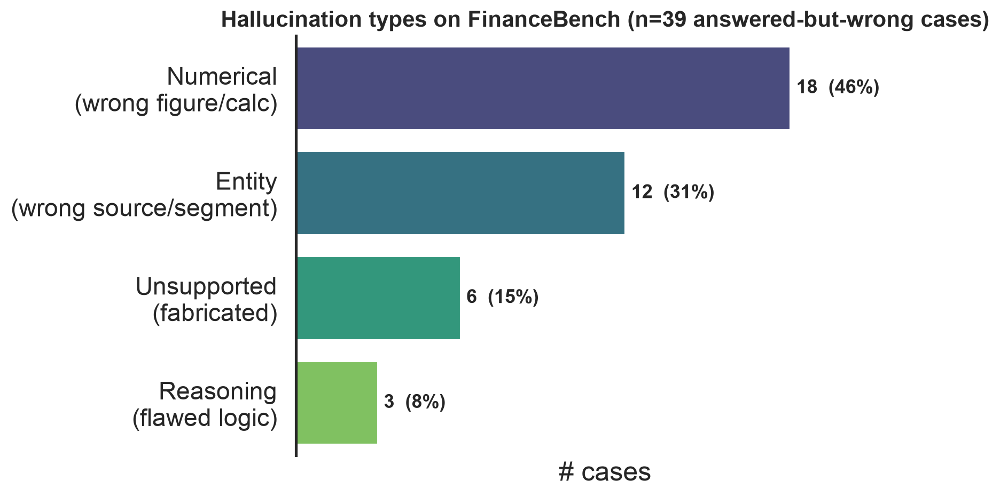

# Introduction

Retrieval-augmented generation [@lewis2020rag] has become the dominant recipe for grounding LLM outputs in verifiable external knowledge. Yet a growing body of work shows that even with relevant context in the prompt, models generate statements that are unsupported by---or contradict---the retrieved passages [@ji2023hallucination; @huang2023hallucinationsurvey]. In *financial* question answering this is especially costly: answers are exact numeric values drawn from dense regulatory filings, and a single fabricated or misattributed figure produces a confidently wrong answer.

We investigate three research questions:

- **RQ1.** How frequently do different RAG pipeline configurations hallucinate on financial QA, and what drives the differences?
- **RQ2.** Which hallucination *types* dominate in finance---numerical, entity, reasoning, or unsupported extrapolation?
- **RQ3.** Does an open, instruction-tuned LLM hallucinate less than GPT-3.5 given the *same* retrieved context?

To answer them we build an end-to-end RAG testbed on FinanceBench, isolate retrieval as an experimental variable across four pipelines, add an open-model generator comparison, and manually taxonomize the residual hallucinations. Section 2 reviews related work; Section 3 analyzes the dataset and why it stresses grounded generation; Section 4 describes our method; Section 5 reports the retrieval, ablation, and generator results (RQ1, RQ3); Section 6 presents the hallucination taxonomy and case studies (RQ2); and Section 7 concludes with limitations and future work.

**Contributions by member.** *Bhalchandra Shinde:* repository/infrastructure, environment, data pipeline, exploratory data analysis, dense and query-rewriting pipelines, the Mistral-7B generator comparison, the error-analysis taxonomy/annotation and figures, and literature notes for @lewis2020rag and @islam2023financebench. *Anish Kelkar:* document chunking, the baseline BM25 pipeline, the evaluation harness (RAGAS + F1/EM), and results tabulation. *Piyush Daga:* the retrieval-depth (top-k) ablation. *Rituraj Singh:* related-work contributions. All members contributed to the final draft.

# Related Work

We organize related work into three themes: RAG methods and retrieval, hallucination detection and evaluation, and financial NLP/QA.

**RAG methods and retrieval.** RAG was introduced by @lewis2020rag, coupling a DPR retriever with a BART generator and framing knowledge as *parametric* (model weights) versus *non-parametric* (an editable document index) memory; it is the architectural baseline our pipelines instantiate. Two of its findings bear directly on our setting. First, RAG answers correctly even when the gold answer appears in *no* retrieved passage verbatim (11.8% of Natural Questions cases), where a purely extractive reader scores zero---the same *abstractive* regime we observe in FinanceBench, where only 2% of gold answers are verbatim in the evidence (Section 3). Second, swapping the document index updates the model's world knowledge with no retraining, underscoring that retrieval quality---not generator memory---governs what a RAG system can ground, which is precisely the bottleneck our results expose. The two retrieval families we compare are defined by BM25 [@robertson2009bm25], a probabilistic term-matching function that is our baseline retriever, and DPR [@karpukhin2020dpr], which learns dense question/passage encoders and beats BM25 on most open-domain QA---motivating our dense pipeline. That dense pipeline embeds chunks with Sentence-BERT [@reimers2019sbert], a siamese-BERT model that produces semantically comparable sentence vectors, the encoder behind our MiniLM index. REALM [@guu2020realm] pre-trains the retriever jointly with a masked LM, and Fusion-in-Decoder [@izacard2021fid] instead fuses many retrieved passages in the decoder; both integrate retrieval more deeply than our prompt-based setup and mark upgrade paths. Self-RAG [@asai2024selfrag] trains a model to decide *when* to retrieve and to critique its own generations with reflection tokens---directly relevant to cutting the unsupported answers we characterize. Query rewriting [@ma2023queryrewriting] expands or reformulates the query before retrieval and is the mechanism of our "enhanced" pipeline. The survey of @gao2023ragsurvey organizes these advances and motivates our controlled comparison of retrieval strategies.

**Hallucination detection and evaluation.** @ji2023hallucination and @huang2023hallucinationsurvey survey hallucination in NLG and LLMs respectively and provide the vocabulary (intrinsic vs.\ extrinsic, faithfulness vs.\ factuality) our taxonomy refines for finance. For measurement, RAGAS [@es2024ragas] supplies reference-free metrics---faithfulness, answer relevancy, context precision---that we adopt as our primary hallucination signal. SelfCheckGPT [@manakul2023selfcheckgpt] detects hallucination without external resources by sampling several responses and measuring their mutual consistency, while FActScore [@min2023factscore] decomposes a generation into atomic facts and scores each against a source---two complementary detection lenses. RAGTruth [@niu2024ragtruth] contributes a word-level hallucination corpus and taxonomy that could supervise an automatic classifier, and the RGB benchmark [@chen2024rgb] evaluates LLM robustness to noisy retrieval---the "wrong context" condition our full-corpus retriever deliberately induces. We additionally report token-level F1/EM following the SQuAD protocol [@rajpurkar2016squad] to capture correctness that faithfulness alone misses, and note RAGBench [@friel2024ragbench] as a cross-domain resource for future comparison.

**Financial NLP and QA.** FinanceBench [@islam2023financebench] is our primary benchmark: 10,231 open-book questions over 361 real 10-K/10-Q/8-K/earnings filings from 40 US companies, of which a human-reviewed 150-question subset (the open-source release) is our evaluation set. Its own experiments motivate our study in three ways. (i) 66% of its questions require *numerical reasoning* rather than extraction---our EDA independently recovers this numeric skew (Section 3), and our taxonomy finds numerical errors are the most common hallucination (Section 6). (ii) Even the best realistic configuration (GPT-4-Turbo, long context) reaches only ~79% accuracy against an 85% oracle ceiling, and confident *hallucination* is a named failure theme---the phenomenon we quantify and taxonomize. (iii) They report that stronger models tend to *refuse* when uncertain while weaker ones answer wrong; we observe the same abstention/faithfulness trade-off between GPT-3.5 and Mistral-7B (Section 5.3), and we adopt their finding that placing context *before* the question helps. Prior financial QA datasets establish that numerical reasoning over hybrid table/text is the core difficulty our EDA also finds: FinQA [@chen2021finqa] pairs expert-written questions with executable reasoning programs over earnings-report tables; ConvFinQA [@chen2022convfinqa] extends this to multi-turn conversational chains; and TAT-QA [@zhu2021tatqa] targets questions that jointly span a table and its surrounding text---exactly the table+prose evidence our chunker must preserve. On the model side, BloombergGPT [@wu2023bloomberggpt], a 50B model pre-trained on a large financial corpus, and FinGPT [@yang2023fingpt], an open finance-LLM framework, show the appetite for finance-specialized models but evaluate generation quality rather than isolating *RAG* hallucination, which is our focus. Our open-source generator comparison uses Mistral-7B-Instruct [@jiang2023mistral], a strong 7B open model, as the RQ3 counterpart to GPT-3.5.

# Data and Exploratory Analysis

**Dataset.** We use the open-source subset of FinanceBench [@islam2023financebench]: 150 QA pairs spanning 32 companies and 84 source filings (fiscal years 2015--2024) across 9 GICS sectors. Question types are balanced by design (50 metrics-generated, 50 domain-relevant, 50 novel-generated). Each record carries a gold answer and an evidence span, letting us judge groundedness directly.

**Findings.** Figure 1 summarizes the analysis (full notebook and figures in the repository). Four properties make this a stress test for grounded generation: (1) *Long, tabular context*---source filings have a median of 128 pages and evidence spans are 69% table-heavy, so retrieval operates over large, noisy documents. (2) *Short, numeric answers*---the median gold answer is 9 words and 84% are numeric, so a single wrong figure flips a correct answer to wrong. (3) *Abstractive answers*---only 2% of gold answers appear *verbatim* in the evidence (mean extractability 0.27); the model must *synthesize* a value, not copy it, which is the core hallucination risk. (4) *Modest lexical overlap*---median question--evidence cosine similarity is 0.47, so retrievers must bridge a vocabulary gap, and 46% of questions require numerical computation or aggregation. These observations justify measuring faithfulness (RAGAS) alongside F1/EM and motivate our four-category hallucination taxonomy.

# Method

**Corpus preparation.** We extract text from all 84 filings with PyMuPDF and split each into fixed 512-token windows (tiktoken `cl100k_base`) with 64-token overlap, yielding 21,876 chunks. Each chunk retains its source-filing id so we can measure whether retrieval reached the correct document. For dense retrieval we embed every chunk once with `all-MiniLM-L6-v2` [@reimers2019sbert] and cache the vectors.

**Pipelines (retrieval variable).** All configurations share the same GPT-3.5-turbo generator (temperature 0), the same prompt, 512-token chunks, and top-3 retrieval; *only retrieval changes*, which isolates its effect (RQ1). We compare:

- **Baseline** --- sparse BM25 retrieval over the entire 84-filing corpus.
- **Dense** --- FAISS inner-product search over L2-normalized MiniLM embeddings (cosine similarity).
- **Enhanced** --- an LLM first rewrites the question into a retrieval query (spelling out abbreviations, adding financial line-item terms), then dense retrieval runs on the rewritten query.
- **Single-doc** --- a known-document upper bound: dense retrieval restricted to the question's own filing, isolating *reading* difficulty from *finding-the-filing* difficulty.

We index the full corpus on purpose---a retriever that can surface the *wrong* filing among 84 is exactly where hallucination appears. The prompt instructs the model to answer only from context and to say "I don't know" when the answer is absent, so a wrong answer is a grounding failure rather than a memory guess. A fixed output schema lets one harness score every pipeline.

**Generator comparison (RQ3).** To test whether the *generator* matters independent of retrieval, we hold the Enhanced pipeline's retrieved context fixed and regenerate every answer with **Mistral-7B-Instruct** [@jiang2023mistral], run locally via Ollama. Because both generators see the *identical* contexts and prompt, any metric difference is attributable to the model alone.

**Evaluation.** We report RAGAS [@es2024ragas] faithfulness, answer relevancy, and context precision, using **GPT-4o-mini** as the judge LLM and local sentence-transformer embeddings, plus SQuAD-style token F1 and Exact Match [@rajpurkar2016squad]. Because gold answers are short numbers formatted many ways (\$1,577 vs.\ 1577.00 vs.\ 1.577 billion), strict EM is near zero, so we also report a **numeric-tolerant EM** (right value within 1%, ignoring format) and faithfulness on the **answered** subset (abstentions carry no claims to ground, so scoring them is meaningless). Retr@$k$ = the share of questions whose top-$k$ retrieval reached the correct filing.

**Error-analysis protocol.** From the Enhanced pipeline we select the 50 *answered-but-incorrect* cases (the model committed to an answer, yet numeric-tolerant EM = 0), stratified across question types. One annotator labels each with a single primary hallucination type (definitions in Section 6), drafting with an LLM and reviewing every label by hand.

# Results

## RQ1: Retrieval is the dominant lever

Table 1 compares the four retrieval configurations. Every metric improves as retrieval improves. The correct filing reaches the top-3 for **43% → 64% → 69%** of questions (BM25 → dense → rewrite); because the model answers only from context, coverage rises in lockstep (**47 → 82 → 87** of 150), and so do context precision (0.24 → 0.42 → 0.46), faithfulness (0.10 → 0.20 → 0.21), token F1 (0.083 → 0.116 → 0.121), and numeric-tolerant EM (0.12 → 0.18 → 0.21). Since only retrieval changed, this isolates **retrieval as the dominant lever (RQ1)**.

| Pipeline           | Retr@3 | Faithful. | Faith(ans) | Ans. Rel. | Ctx. Prec. | Answered | F1    | EM (num) |
| ------------------ | ------ | --------- | ---------- | --------- | ---------- | -------- | ----- | -------- |
| Baseline (BM25)    | 43%    | 0.104     | 0.408      | 0.234     | 0.240      | 47/150   | 0.083 | 0.120    |
| Dense (FAISS)      | 64%    | 0.197     | 0.352      | 0.414     | 0.417      | 82/150   | 0.116 | 0.180    |
| Enhanced (rewrite) | 69%    | 0.209     | 0.353      | 0.432     | 0.462      | 87/150   | 0.121 | 0.207    |
| Dense, single-doc  | 100%   | 0.300     | 0.572      | 0.424     | 0.435      | 96/150   | 0.139 | 0.267    |

: Retrieval-strategy comparison on FinanceBench (all 150 questions). Generator = GPT-3.5-turbo (temp 0); RAGAS judge = GPT-4o-mini. Faith(ans) = faithfulness over answered questions only; EM (num) = numeric-tolerant exact match.

Two nuances matter for interpreting hallucination. First, **strict EM ≈ 0 understates accuracy**: the numeric-tolerant EM shows 33--42% of *answered* questions are actually correct---the model was penalized for formatting, not for being wrong. Second, **overall faithfulness is dragged down by abstentions** (an "I don't know" has nothing to ground); on the answered subset faithfulness is moderate (0.35--0.57), i.e.\ when the model commits it is partly---not fully---grounded, which is exactly the hallucination we study. The known-document upper bound makes the ceiling explicit: restricting retrieval to the correct filing lifts Retr@3 to 100%, coverage to 96/150, F1 to 0.139, and answered-faithfulness to 0.57---yet a third of questions still go unanswered, so finding the right filing is necessary but not sufficient.

## Retrieval-depth ablation (top-k)

Holding the dense pipeline otherwise fixed, we vary retrieval depth (Table 2). Increasing top-$k$ from 3 to 5 raises the chance the correct filing is retrieved (Retr@$k$ 64% → 73%), lifts coverage (82 → 97 of 150), and improves faithfulness (0.197 → 0.248), F1, and numeric-tolerant EM. Context precision dips slightly (0.42 → 0.39), as expected when more chunks are admitted, but the net effect is positive---consistent with retrieval recall being the binding constraint.

| Top-$k$ | Retr@$k$ | Faithful. | Faith(ans) | Ans. Rel. | Ctx. Prec. | Answered | F1    | EM (num) |
| --------- | ---------- | --------- | ---------- | --------- | ---------- | -------- | ----- | -------- |
| 3         | 64%        | 0.197     | 0.352      | 0.414     | 0.417      | 82/150   | 0.116 | 0.180    |
| 5         | 73%        | 0.248     | 0.397      | 0.468     | 0.388      | 97/150   | 0.126 | 0.220    |

: Retrieval-depth ablation on the dense pipeline (GPT-3.5, 512-token chunks, GPT-4o-mini judge).

## RQ3: Generator held to identical context

Table 3 compares GPT-3.5-turbo and Mistral-7B-Instruct answering over the *same* retrieved contexts. Given identical evidence, the smaller open model is **markedly more faithful** (0.59 vs.\ 0.21 overall; 0.63 vs.\ 0.35 on answered questions only, so the gap is not merely an abstention artifact) and nearly **twice as accurate on numbers** (numeric-tolerant EM 0.37 vs.\ 0.21). The trade-off is coverage: Mistral is **more conservative**, answering 69/150 versus GPT-3.5's 87 and preferring "I don't know" over a guess. Its lower answer relevancy (0.25 vs.\ 0.43) largely reflects that higher abstention rate, since a refusal scores as not relevant to the question.

| Generator           | Faithful. | Faith(ans) | Ans. Rel. | Ctx. Prec. | Answered | F1    | EM (num) |
| ------------------- | --------- | ---------- | --------- | ---------- | -------- | ----- | -------- |
| GPT-3.5-turbo       | 0.209     | 0.353      | 0.432     | 0.462      | 87/150   | 0.121 | 0.207    |
| Mistral-7B-Instruct | 0.592     | 0.631      | 0.254     | 0.411      | 69/150   | 0.128 | 0.373    |

: Generator comparison on identical Enhanced retrieval (RQ3). Only the answer generator differs.

This inverts the naive expectation behind RQ3 ("do larger models hallucinate less?"): here the 7B open model is the *more* faithful one. The mechanism is abstention---Mistral declines more often, so its committed answers are better grounded. Thus on this benchmark **abstention behavior, not raw model scale, is what drives faithfulness**, echoing the refuse-vs-answer-wrong contrast reported for FinanceBench [@islam2023financebench].

# Error Analysis and Hallucination Taxonomy (RQ2)

**Taxonomy.** We label each answered-but-incorrect case with one primary hallucination type:

- **Numerical** --- the entities and intent are right but the *value* is wrong (miscalculation, wrong period/unit, misread figure).
- **Entity** --- the wrong *source entity*: wrong company, segment, or statement, often because retrieval surfaced the wrong filing.
- **Reasoning** --- the retrieved numbers are right but the *inference* connecting them to the answer is flawed.
- **Unsupported** --- a claim not traceable to any retrieved passage (fabricated figure or qualitative claim).

**A caution on automatic flagging.** Of the 50 cases automatically flagged as failures, manual review found **11 (≈22%) were actually correct**---the model answered the question well but was mis-scored (e.g.\ a format the numeric filter missed, or a "Yes"+extra-figures answer graded against a "Yes"-only gold). We exclude these from the taxonomy and report them as a finding in their own right: automatic hallucination/accuracy metrics on numeric financial QA carry a non-trivial false-positive rate, and human review remains necessary.

**Type frequencies.** Among the 39 genuine hallucinations, numerical errors dominate (Figure 2): **numerical 46% (18)**, **entity 31% (12)**, **unsupported 15% (6)**, **reasoning 8% (3)**. This matches the dataset's numeric skew (Section 3): the hardest part is producing the *right number* from the right place, not stringing together a chain of inferences. Entity errors---the second most common---are overwhelmingly retrieval failures where the model answered confidently from the wrong filing, tying RQ2 back to the retrieval bottleneck of RQ1.

**Case studies.** Table 4 gives two representative examples per type. The numerical cases include order-of-magnitude slips (a \$25.8B free-cash-flow answer where the gold is \$3.2B) and wrong intermediate figures (a dividend-payout ratio of 0.43 vs.\ 0.8). Entity cases are stark: asked what drove AMD's FY22 revenue, the model answered with Lockheed Martin F-16/F-22 content pulled from the wrong filing. Unsupported cases fabricate specifics---naming a registered security when the gold answer is "there are none." Reasoning cases keep the right inputs but draw the wrong conclusion, e.g.\ comparing the wrong pair of fiscal years and thus reporting debt as rising when it fell.

| Type        | Company       | Question                                         | Model answer                      | Gold                       | Why it is wrong                             |
| ----------- | ------------- | ------------------------------------------------ | --------------------------------- | -------------------------- | ------------------------------------------- |
| Numerical   | General Mills | FY2020 free cash flow (from cash-flow statement) | \$25,825 million                  | \$3,215                    | order-of-magnitude error                    |
| Numerical   | Coca-Cola     | FY2022 dividend payout ratio                     | 42.68%                            | 0.80 (80%)                 | wrong dividends figure                      |
| Entity      | AMD           | What drove FY22 revenue change?                  | Lockheed F-16/F-22 program volume | AMD EPYC/semi-custom sales | answered from the wrong company's filing    |
| Entity      | Amex          | Geographies it operates in (2022)                | Phoenix, Sunrise, Gurgaon, …     | US, EMEA, APAC, LACC       | listed office cities, not operating regions |
| Unsupported | Amex          | Debt securities registered to trade              | a specific deferred-comp plan     | there are none             | fabricated a security                       |
| Unsupported | Pfizer        | Spinning off any large segments (Q2'23)?         | not spinning off any              | Yes---Upjohn               | contradicts the filing                      |
| Reasoning   | Verizon       | Did debt increase 2021→2022?                    | Yes (used 2020→2021)             | No, it decreased           | compared the wrong fiscal years             |
| Reasoning   | 3M            | Capital-intensive in FY2022?                     | Yes                               | No                         | opposite interpretation of the same figures |

: Representative case studies, two per hallucination type (from the 50 labeled cases).

**Toward automatic detection.** As a proof of concept, we fine-tuned `roberta-base` on the QA subset of RAGTruth [@niu2024ragtruth] (a response is labeled hallucinated if it carries any annotated span) and applied it zero-shot to our 50 labeled cases. It transfers with F1 0.81 (precision 0.77, recall 0.85), catching 33 of 39 hallucinations---but it correctly clears only 1 of 11 grounded answers, and on the RAGTruth test split it behaves the same way (recall 0.92, precision 0.24). The detector is therefore a high-recall *over-flagger*: useful as a first-pass filter that rarely misses a hallucination, but too imprecise to trust unaided. A precise, calibrated detector remains future work.

# Conclusion, Limitations, and Future Work

We studied when and how RAG systems hallucinate on financial QA. Across four pipelines that differ only in retrieval, **retrieval quality is the dominant lever** on faithfulness and accuracy (RQ1), reinforced by a top-$k$ ablation. A manual taxonomy shows **numerical errors dominate** the residual hallucinations, with entity errors---mostly wrong-filing retrievals---a close second (RQ2). Holding retrieved context fixed, the open **Mistral-7B-Instruct is more faithful than GPT-3.5** by abstaining more (RQ3), indicating that grounding on this benchmark is governed more by abstention behavior than by model scale. We also find that ~22% of automatically flagged failures are correct answers mis-scored---a caution for automatic evaluation.

**Limitations.** (1) *Single annotator.* The 50 cases were labeled by one annotator (LLM-drafted, human-reviewed), so we do not report inter-annotator agreement (Cohen's kappa); a second independent pass would strengthen the taxonomy. (2) *PDF table extraction* flattens tables into linear text, which can sever a figure from its row/column headers and is a plausible source of numerical errors. (3) *Scale:* we evaluate the 150-question open subset, not the full 10,231-question FinanceBench. (4) *Judge dependence:* RAGAS faithfulness relies on an LLM judge (GPT-4o-mini); absolute values should be read comparatively.

**Future work.** Table-aware chunking that preserves headers; retrieval upgrades (Fusion-in-Decoder [@izacard2021fid], Self-RAG [@asai2024selfrag]) to close the remaining recall gap; turning our proof-of-concept RAGTruth-trained detector into a *precise*, calibrated classifier (it currently over-flags); and scaling the evaluation to the full benchmark.

# References
