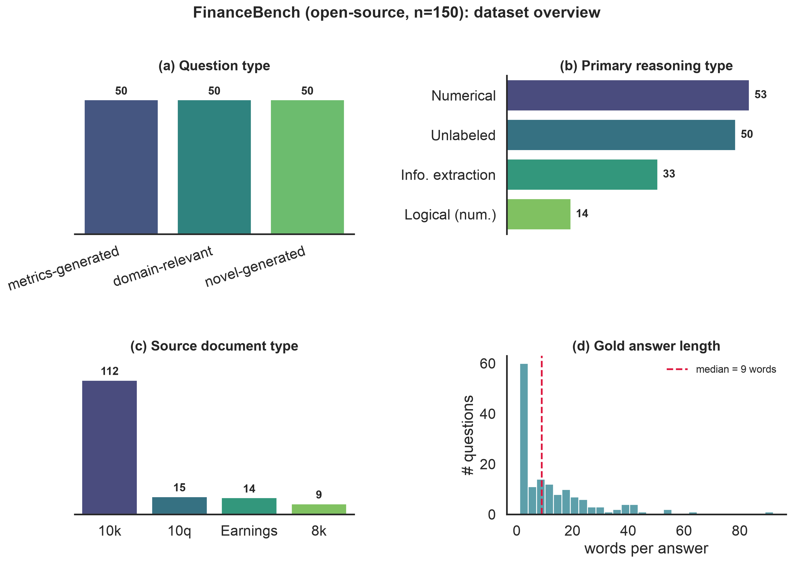

# Introduction

Retrieval-augmented generation [@lewis2020rag] has become the dominant recipe for grounding LLM outputs in verifiable external knowledge. Yet a growing body of work shows that even with relevant context in the prompt, models generate statements that are unsupported by---or contradict---the retrieved passages [@ji2023hallucination; @huang2023hallucinationsurvey]. In *financial* question answering this is especially costly: answers are exact numeric values drawn from dense regulatory filings, and a single fabricated or misattributed figure produces a confidently wrong answer.

We investigate three research questions:

- **RQ1.** How frequently do different RAG pipeline configurations hallucinate on financial QA?
- **RQ2.** Which hallucination *types* dominate in finance---numerical, entity, reasoning, or unsupported extrapolation?
- **RQ3.** Do larger / instruction-tuned LLMs hallucinate less given the same retrieved context?

This report establishes the foundation for answering them: a literature review (Section 2), an exploratory analysis of FinanceBench that motivates the difficulty (Section 3), and a working baseline pipeline with preliminary faithfulness and accuracy metrics (Section 4). We close with the roadblocks this early evidence surfaces (Section 5).

**Contributions.** Bhalchandra Shinde: repository/infrastructure, environment, data pipeline, exploratory data analysis, and literature-review notes for @lewis2020rag and @islam2023financebench. Anish Kelkar: document chunking, baseline RAG pipeline, evaluation harness (RAGAS + F1/EM), and results tabulation. Piyush Daga and Rituraj Singh: remaining related-work papers and paper writing. All members contributed to the final draft.

# Related Work

We organize related work into three themes: RAG methods and retrieval, hallucination detection and evaluation, and financial NLP/QA.

**RAG methods and retrieval.** RAG was introduced by @lewis2020rag, coupling a DPR retriever with a BART generator and framing knowledge as *parametric* (model weights) versus *non-parametric* (an editable document index) memory; it is the architectural baseline our pipelines instantiate. Two of its findings bear directly on our setting. First, RAG answers correctly even when the gold answer appears in *no* retrieved passage verbatim (11.8% of Natural Questions cases), where a purely extractive reader scores zero---the same *abstractive* regime we observe in FinanceBench, where only 2% of gold answers are verbatim in the evidence (Section 3). Second, swapping the document index updates the model's world knowledge with no retraining, underscoring that retrieval quality---not generator memory---governs what a RAG system can ground, which is precisely the bottleneck our results expose. The two retrieval families we compare are defined by BM25 [@robertson2009bm25], a probabilistic term-matching function that is our baseline retriever, and DPR [@karpukhin2020dpr], which learns dense question/passage encoders and beats BM25 on most open-domain QA---motivating our planned dense pipeline. That dense pipeline embeds chunks with Sentence-BERT [@reimers2019sbert], a siamese-BERT model that produces semantically comparable sentence vectors, the encoder behind our MiniLM index. REALM [@guu2020realm] pre-trains the retriever jointly with a masked LM, and Fusion-in-Decoder [@izacard2021fid] instead fuses many retrieved passages in the decoder; both integrate retrieval more deeply than our prompt-based setup and mark upgrade paths we may explore. Self-RAG [@asai2024selfrag] trains a model to decide *when* to retrieve and to critique its own generations with reflection tokens---directly relevant to cutting the unsupported answers we aim to reduce. Query rewriting [@ma2023queryrewriting] expands or reformulates the query before retrieval and is exactly the mechanism of our planned "enhanced" pipeline. The recent survey of @gao2023ragsurvey organizes these advances and motivates our controlled comparison of retrieval strategies.

**Hallucination detection and evaluation.** @ji2023hallucination and @huang2023hallucinationsurvey survey hallucination in NLG and LLMs respectively and provide the vocabulary (intrinsic vs. extrinsic, faithfulness vs. factuality) our taxonomy refines for finance. For measurement, RAGAS [@es2024ragas] supplies reference-free metrics---faithfulness, answer relevancy, context precision---that we adopt as our primary hallucination signal. SelfCheckGPT [@manakul2023selfcheckgpt] detects hallucination without external resources by sampling several responses and measuring their mutual consistency, while FActScore [@min2023factscore] decomposes a generation into atomic facts and scores each against a source---two complementary detection lenses we consider for the final error analysis. RAGTruth [@niu2024ragtruth] contributes a word-level hallucination corpus and taxonomy that we will use as supervision for the (optional) automatic classifier, and the RGB benchmark [@chen2024rgb] evaluates LLM robustness to noisy retrieval---the "wrong context" condition our full-corpus retriever deliberately induces. We additionally report token-level F1/EM following the SQuAD protocol [@rajpurkar2016squad] to capture correctness that faithfulness alone misses, and note RAGBench [@friel2024ragbench] as a cross-domain resource for future comparison.

**Financial NLP and QA.** FinanceBench [@islam2023financebench] is our primary benchmark: 10,231 open-book questions over 361 real 10-K/10-Q/8-K/earnings filings from 40 US companies, of which a human-reviewed 150-question subset (the open-source release) is our evaluation set. Its own experiments motivate our study in three ways. (i) 66% of its questions require *numerical reasoning* rather than extraction---our EDA independently recovers this numeric skew (Section 3). (ii) Even the best realistic configuration (GPT-4-Turbo, long context) reaches only ~79% accuracy against an 85% oracle ceiling, and confident *hallucination* is a named failure theme---the phenomenon we set out to quantify and taxonomize. (iii) They report that stronger models tend to *refuse* when uncertain while weaker ones answer wrong; our GPT-3.5 baseline likewise abstains rather than fabricate (Section 4), and they find placing context *before* the question is critical---a design choice our prompt template adopts. Prior financial QA datasets establish that numerical reasoning over hybrid table/text is the core difficulty our EDA also finds: FinQA [@chen2021finqa] pairs expert-written questions with executable reasoning programs over earnings-report tables; ConvFinQA [@chen2022convfinqa] extends this to multi-turn conversational chains; and TAT-QA [@zhu2021tatqa] targets questions that jointly span a table and its surrounding text---exactly the table+prose evidence our chunker must preserve. On the model side, BloombergGPT [@wu2023bloomberggpt], a 50B model pre-trained on a large financial corpus, and FinGPT [@yang2023fingpt], an open finance-LLM framework, show the appetite for finance-specialized models but evaluate generation quality rather than isolating *RAG* hallucination, which is our focus. Our open-source generator comparison will use Mistral-7B-Instruct [@jiang2023mistral], a strong 7B open model, as the RQ3 counterpart to GPT-3.5.

# Data and Exploratory Analysis

**Dataset.** We use the open-source subset of FinanceBench [@islam2023financebench]: 150 QA pairs spanning 32 companies and 84 source filings (fiscal years 2015--2024) across 9 GICS sectors. Question types are balanced by design (50 metrics-generated, 50 domain-relevant, 50 novel-generated). Each record carries a gold answer and an evidence span, letting us judge groundedness directly.

**Findings.** Figure 1 summarizes the analysis (full notebook and 22 figures in the repository). Four properties make this a stress test for grounded generation: (1) *Long, tabular context*---source filings have a median of 128 pages and evidence spans are 69% table-heavy, so retrieval operates over large, noisy documents. (2) *Short, numeric answers*---the median gold answer is 9 words and 84% are numeric, so a single wrong figure flips a correct answer to wrong. (3) *Abstractive answers*---only 2% of gold answers appear *verbatim* in the evidence (mean extractability 0.27); the model must *synthesize* a value, not copy it, which is the core hallucination risk. (4) *Modest lexical overlap*---median question--evidence cosine similarity is 0.47, so retrievers must bridge a vocabulary gap, and 46% of questions require numerical computation or aggregation. These observations justify measuring faithfulness (RAGAS) alongside F1/EM and motivate our four-category hallucination taxonomy.

# Preliminary Method and Results

**Pipelines.** All configurations share the same GPT-3.5-turbo generator (temperature 0), prompt, 512-token chunks, and top-3 retrieval; only *retrieval* changes, which isolates its effect. We compare **Baseline** (BM25 sparse retrieval over the entire 84-filing corpus), **Dense** (FAISS over MiniLM embeddings), and **Enhanced** (an LLM rewrites the query before dense retrieval), plus a known-document upper bound (**Single-doc**: retrieval restricted to the question's own filing). We index the full corpus on purpose---a retriever that can surface the *wrong* filing among 84 is exactly where hallucination appears. The prompt instructs the model to answer only from context and to say "I don't know" when the answer is absent, so a wrong answer is a grounding failure rather than a memory guess. A fixed output schema lets one harness score every pipeline.

**Evaluation.** We report RAGAS [@es2024ragas] faithfulness, answer relevancy, and context precision (LLM judge: GPT-4o-mini; local sentence-transformer embeddings), plus SQuAD-style token F1 and Exact Match [@rajpurkar2016squad]. Because gold answers are short numbers formatted many ways ($1,577 vs. 1577.00 vs. 1.577 billion), strict EM is near zero, so we also report a **numeric-tolerant** EM (right value within 1%, ignoring format) and faithfulness on the **answered** subset. Retr@3 = share of questions whose top-3 retrieval reached the correct filing.

| Pipeline | Retr@3 | Faithful. | Faith(ans) | Ans. Rel. | Ctx. Prec. | Answered | F1 | EM (num) |
|---|---|---|---|---|---|---|---|---|
| Baseline (BM25) | 43% | 0.104 | 0.408 | 0.234 | 0.240 | 47/150 | 0.083 | 0.120 |
| Dense (FAISS) | 64% | 0.197 | 0.352 | 0.414 | 0.417 | 82/150 | 0.116 | 0.180 |
| Enhanced (rewrite) | 69% | 0.209 | 0.353 | 0.432 | 0.462 | 87/150 | 0.121 | 0.207 |
| Dense, single-doc | 100% | 0.300 | 0.572 | 0.424 | 0.435 | 96/150 | 0.139 | 0.267 |

**Results.** Every metric improves as retrieval improves. The correct filing reaches the top-3 for **43% → 64% → 69%** of questions (BM25 → dense → rewrite); because the model answers only from context, coverage rises in lockstep (**47 → 82 → 87** of 150), and so do context precision (0.24 → 0.42 → 0.46), faithfulness (0.10 → 0.20 → 0.21), token F1 (0.083 → 0.116 → 0.121), and numeric-tolerant EM (0.12 → 0.18 → 0.21). Since only retrieval changed, this isolates **retrieval as the dominant lever (RQ1)**. Strict EM ~0 understates accuracy: the numeric-tolerant EM shows 33–42% of *answered* questions are actually correct---the model was penalized for formatting, not errors. Faithfulness is low overall, but that is dominated by abstentions (an "I don't know" has nothing to ground); on the answered subset it is moderate (0.35–0.57), i.e. when the model commits to an answer it is partly---not fully---grounded, which is precisely the hallucination we study. The known-document upper bound makes the ceiling explicit: restricting retrieval to the correct filing lifts Retr@3 to 100%, coverage to 96/150, F1 to 0.139, and answered-faithfulness to 0.57---yet a third of questions still go unanswered, so finding the right filing is necessary but not sufficient. Those answered-but-unsupported cases are exactly what our error analysis will taxonomize.

# Roadblocks and Next Steps

The preliminary run isolates the key bottleneck: sparse full-corpus retrieval often fails to surface the correct filing, so the model either abstains or answers from wrong context. This directly shapes our plan: (1) dense retrieval (FAISS + sentence embeddings) and query rewriting to raise retrieval recall (RQ1); (2) an open-source generator (Mistral-7B [@jiang2023mistral]) under the same retrieval config to test RQ3; and (3) manual annotation of 50 failure cases into our four-type taxonomy (numerical, entity, reasoning, unsupported extrapolation) to answer RQ2. The main risks are OpenAI API cost control (run once at temperature 0) and the fidelity of PDF table extraction, which flattens tables into linear text and is a known limitation we will quantify.

# References
