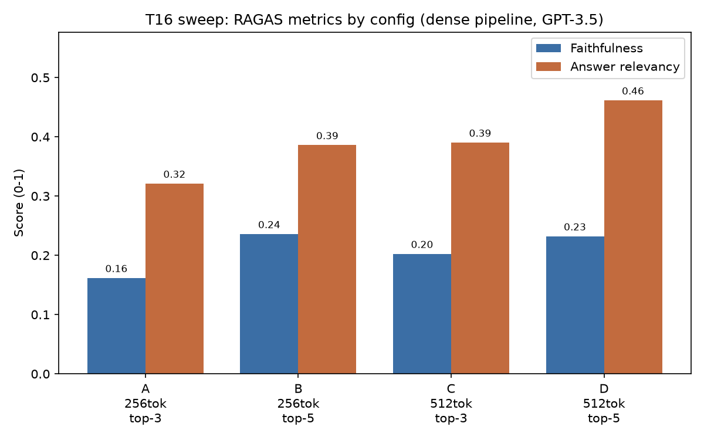

# T16 Hyperparameter Sweep Results

Dense (FAISS + MiniLM) pipeline, GPT-3.5-turbo generator, temperature 0.0, full 150-question FinanceBench set. RAGAS judge: GPT-3.5-turbo; embeddings: local MiniLM.

| Config | Chunk (tok) | Top-k | Faithfulness | Answer Rel. | Ctx. Prec. | F1 | Numeric-EM | Answered |
|--------|-------------|-------|--------------|-------------|-----------|-----|-----------|----------|
| A | 256 | 3 | 0.1618 | 0.3210 | 0.7594 | 0.0919 | 0.1667 | 66 |
| B | 256 | 5 | 0.2359 | 0.3860 | 0.7420 | 0.1308 | 0.2200 | 89 |
| C | 512 | 3 | 0.2025 | 0.3903 | 0.7850 | 0.1166 | 0.2133 | 88 |
| D | 512 | 5 | 0.2321 | 0.4615 | 0.7796 | 0.1276 | 0.2333 | 98 |

**Best config (by faithfulness):** Config B — 256-token chunks, top-5 (faithfulness 0.2359, F1 0.1308, answered 89/150).

_Note: top-k = 5 outperforms top-k = 3 on faithfulness and answer relevancy across configs. The two top-5 configs (B and D) are close on faithfulness; the 256- vs 512-token choice is the main open decision and is worth confirming with the team before carrying one config into T17._