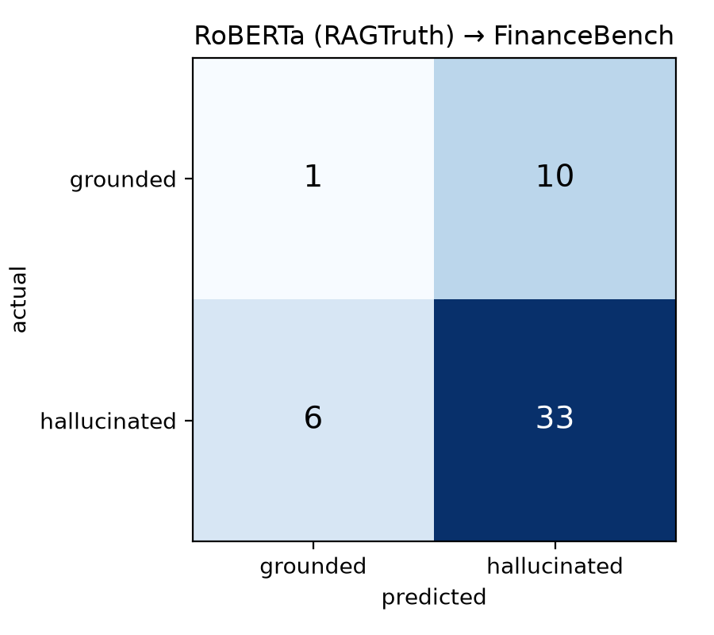

# T24: RoBERTa hallucination classifier (optional)

`roberta-base` fine-tuned on the RAGTruth QA subset (5034 train responses, hallucinated = any annotated span), evaluated on the RAGTruth QA test split and, zero-shot, on our 50 labeled FinanceBench cases (hallucinated = any of the four taxonomy types; grounded = the 11 'other' cases that were actually correct). 2 epochs, class-weighted loss, max_len 256.

| Eval set | N | Accuracy | Precision | Recall | F1 |
|---|---|---|---|---|---|
| RAGTruth-QA test | 900 | 0.480 | 0.244 | 0.919 | 0.386 |
| FinanceBench-50 (transfer) | 50 | 0.680 | 0.767 | 0.846 | 0.805 |

